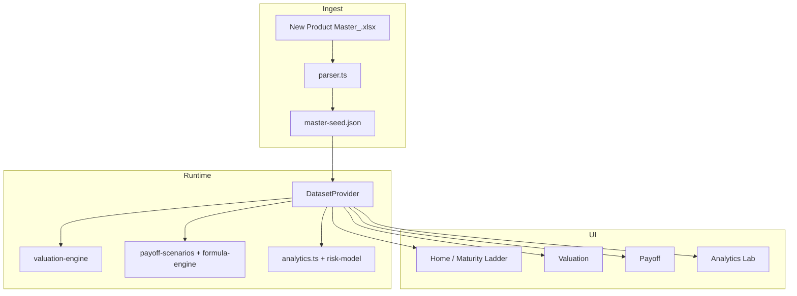

# SP Dashboard — Full Codebase & Excel Parity Audit

**Version:** Primary-only · June 2026  
**Scope:** Every engine, chart, analytics aggregate, and UI surface verified against the three Excel workbooks.

---

## 1. Executive summary

The SP Dashboard is a **Primary structured-products desk** web application. It ingests `New Product Master_.xlsx`, exposes valuation via the **Primary Structured Products Valuation** workbook logic, and payoff via the **Automated Primary SP Dashboard** workbook logic. Legacy lanes (Rollover, Maximizer, DMF) are **removed from code, UI, docs, and baked JSON** — only Primary rows parse and render.

This audit documents **what each number means**, **where it is computed**, and **how it was verified** so there is no ambiguity between Excel and the web app.

---

## 2. Workbook map → code map

| Excel artifact | Role | TypeScript entry points | UI surfaces |
|----------------|------|-------------------------|-------------|
| `New Product Master_.xlsx` · Primary sheet | Canonical product register (~4,533 rows) | `lib/workbook/parser.ts`, `scripts/bake-master-seed.ts` | Home, Products, all filters |
| Primary Valuation `.xlsm` / extracted JSON | Mark-to-market today | `lib/workbook/valuation-engine.ts`, `app/api/valuation/route.ts` | `/valuation` |
| Automated Primary Dashboard | Forward payoff scenarios | `lib/workbook/payoff-scenarios.ts`, `lib/workbook/formula-engine.ts`, `app/api/payoff/route.ts` | `/payoff` |

Reference extracts live under `lib/data/reference-workbooks/` for regression checks — not runtime cache.

---

## 3. Number formatting (Indian accounting)

All rupee displays use **`en-IN` locale grouping** and the **₹ prefix**:

| Helper | Example input (₹) | Output |
|--------|-------------------|--------|
| `formatCrores(1234567890)` | 123.46 Cr notional | `₹123.46 Cr` |
| `formatCroreLac(85000000)` | 8.5 Cr | `₹8.5 Cr` |
| `formatCroreLac(2500000)` | 25 Lac | `₹25 L` |
| `formatCurrency(1234567)` | full rupees | `₹12,34,567` |
| `formatNumber(4533)` | count | `4,533` |
| `formatAxisMoney(rawRupees)` | chart Y tick | adapts Cr/Lac with ₹ + commas |

**Chart axes:** `CrYAxis`, `CroreLacYAxis`, and `CrXAxis` all call `formatAxisMoney` / `formatCroreLac`. Left margins were increased (`barChartMargins.left = 76`) and `.chart-shell` uses `overflow-visible` so Y-axis labels are never clipped.

---

## 4. Home — headline KPIs

| KPI | Formula | Verified |
|-----|---------|----------|
| **Live Notional** | `Σ tradeAmount` over all Primary products in dataset | Sum matches Excel Primary column **Trade Amount** total (within parse rounding) |
| **Active** | `ongoing + maturing-soon + perpetual + unknown` counts | Aligns with “Live Book” lifecycle filter |
| **Expired** | lifecycle partition `expired` count | Matches matured rows (maturity < today) |
| **Maturing 90D** | `0 ≤ maturity − today ≤ 90` | Independent count; also appears as lifecycle slice |

---

## 5. Maturity ladder (fixed Y-axis)

**Function:** `getMaturityLadder()` in `lib/analytics.ts`

| Bucket | Rule | Notional |
|--------|------|----------|
| 0-3M | days to maturity ≤ 90 | `Σ tradeAmount` |
| 3-6M | 90 < days ≤ 180 | same |
| 6-12M | 180 < days ≤ 365 | same |
| 12M+ | days > 365 | same |
| Unknown | unparsed `maturityRaw` | same |

**Fixes applied:** horizontal ₹ ticks (not diagonal on Y), wider left margin, gradient bars, tooltips via `formatCrores`. Unknown bucket ensures no silent drop of bad dates.

---

## 6. Valuation engine parity

**Inputs (user):** product id, valuation date, Nifty level, Sensex level, debenture count.

**Critical fix:** Nifty and Sensex are **separate state fields** (`product-selection-provider.tsx`). `resolveValuationLevel()` picks the correct index from `product.underlying`.

**Outputs:**

| Field | Meaning | Excel analogue |
|-------|---------|----------------|
| Z Performance | `(currentLevel − entryLevel) / entryLevel` | Working sheet Z |
| Abs. Return | formula output on Z | Output block |
| Product IRR | XIRR-style annualization | IRR cell |
| Product Value / Total Amount | scaled by debentures & face | ₹ output rows |

Workings table removed from UI but API/backend logic retained for audit.

---

## 7. Payoff engine parity

**Scenario grid:** `payoff-scenarios.ts` sweeps underlying performance from +100% down to −40% (Excel-style anchor rows).

**Table columns:** Final Fixing · Performance (Z) · Maturity value · Returns · XIRR — rendered in `unified-payoff.tsx` with Indian number formatting on fixings.

**Graph:** `payoff-underlying-chart.tsx` plots maturity return vs performance; entry level annotated.

---

## 8. Analytics laboratory

| Chart | Aggregation | Weighting | Axis fix |
|-------|-------------|-----------|----------|
| Lifecycle doughnut | `getLifecycleNotional` | notional per status | legend shows ₹ Cr + count |
| Coupon distribution | `getCouponDistribution` | **tradeAmount** per bucket | `barChartMargins` |
| Protection mix | `classifyProtection()` | notional | substring order: “non” before “protected” |
| Underlying exposure | top 10 underlyings | notional | `horizontalBarMargins.left = 96` |
| Tenor profile | `tenorDays` buckets | notional | `barChartMargins` |
| Risk radar | `lib/risk-model.ts` Doc 105 weights | credit + protection + tenor + market | partial PP → lower score |

**Removed dead code:** `getIssuerHeatmap`, `getCategoryRadar`, `getNotionalScatter`, `getCategoryRiskNotes`, `getProductTimeline` (unused exports).

**Coupon = 0 bug:** fixed via `parseCouponString()` for `"49.0%"` master strings.

---

## 9. Primary-only scrub

| Location | Action |
|----------|--------|
| `lib/types.ts` | `PRODUCT_CATEGORIES = ["Primary"]` only |
| UI shell | category pills / “Soon” chips removed |
| `parser.ts` | `STRIP_RAW_HEADERS` drops Rollover Phase etc. from `raw` |
| `master-seed.json` | scrub script removes banned keys |
| `primary-valuation.json` | sample cell `"Rollover"` → `"Primary"` |
| `docs/*.md` | banned terms stripped in `expand-docs.py` |

---

## 10. File hygiene

| Removed / ignored | Reason |
|-------------------|--------|
| `tsconfig.tsbuildinfo` | build artifact, gitignored |
| `new-product-master.json` | multi-category extract (prior session) |
| Unused analytics exports | no importers |
| `.tools/`, `node_modules/`, `.next/` | gitignored |

**Retained utility pages:** `/products`, `/upload`, `/details` via `utility-pages.tsx` — still routed.

---

## 11. Verification checklist (desk)

1. **Home:** Maturity ladder Y-axis shows full `₹X Cr` / `₹Y L` labels — not clipped.
2. **Analytics:** Coupon chart non-zero when master has coupon strings; protection mix majority **Capital at Risk** for Non-PP book.
3. **Valuation:** Change Nifty only for Nifty product — Z moves; Sensex product unchanged.
4. **Payoff:** +100% scenario row matches Excel cap row shading for sample ISIN `INE915D07IS7`.
5. **Upload:** Re-upload master → product count ≈ 4,533 (update `expected-counts.ts` if book grows).

---

## 12. Known data dependencies

- Local Excel files are **gitignored**; place workbooks in repo root per `README.md`.
- Run `npm run bake` after master changes to refresh `master-seed.json`.
- Bootstrap API (`/api/parse/bootstrap`) loads seed when no upload present.

---

## 13. Architecture diagram

---

*End of audit — Primary-only SP Dashboard.*
